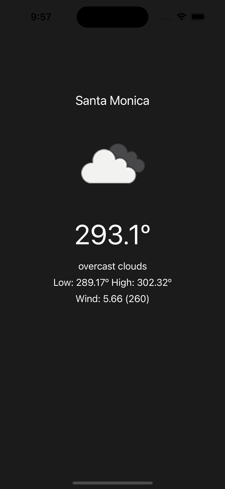

# WeatherApp

This demo simply displays the weather at the given coordinates.

## Tech Stack

**Language:** Swift

**Architecture:** MVVM

**Frameworks:** UIKit, Foundation, Combine

**Tests:** Unit test, UI tests

## Screenshots

## Author

Matias Leandro Martin Roldan

roldanmatias@gmail.com

https://www.linkedin.com/in/roldanmatias/

